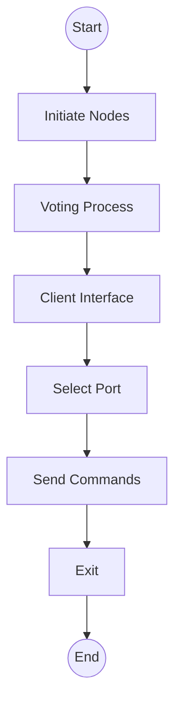
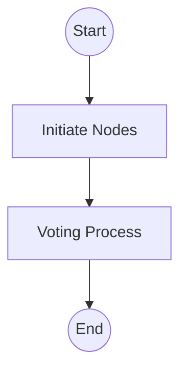
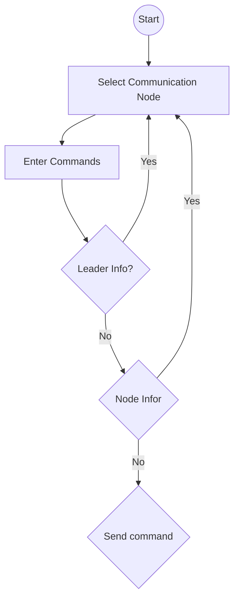

---

## **ARCHITECTURE.md**

markdown
# Architectural Design Document

## 1. Overview

This project implements a simplified **replicated log service** based on the **Raft consensus algorithm**.  
The system consists of multiple nodes (each representing a Raft server) that coordinate to elect a leader and replicate client commands consistently across all logs.

---

## 2. High-Level Architecture


Start up graph


Client Interface



---

## 3. Key Components

| Component | Responsibility |
|------------|----------------|
| **MessageServer** | Listens for incoming RPC messages (RequestVote, AppendEntries). |
| **MessageClient** | Sends RPCs between nodes asynchronously. |
| **NodeState** | Stores term, votedFor, log entries, commit index, leaderId, etc. Persisted to disk. |
| **ElectionManager** | Handles election timeout and leader selection using randomized timers. |
| **NodeTimers** | Manages periodic heartbeat sending by the leader and triggers elections. |
| **ClientInterface** | Interacts with the user. Sends requests and displays results. |

---

## 4. Data Persistence

Each node persists:
- state.json → currentTerm, votedFor, commitIndex
- log.json → all committed log entries
- manual_log.txt → plain-text trace log

Example entry in `log.json`:
```json
[
  {"term": 14, "command": "hi.."},
  {"term": 14, "command": "hi..."}
]
