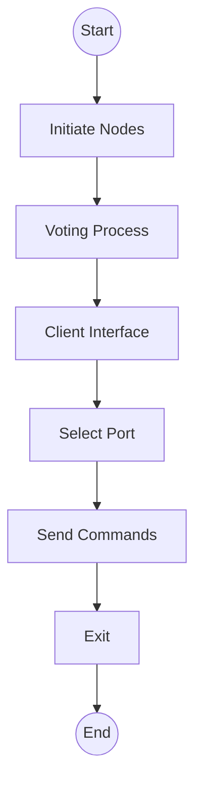
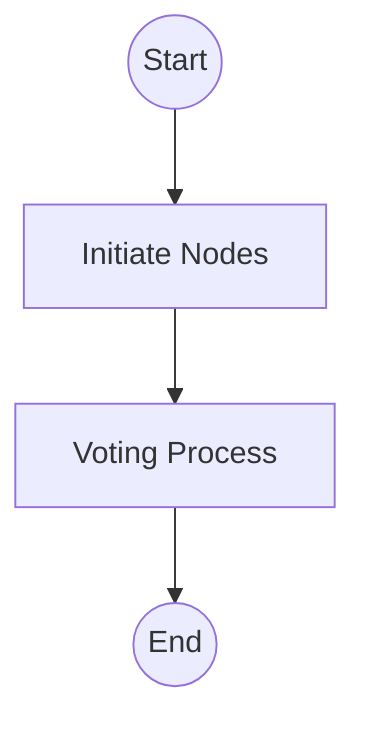
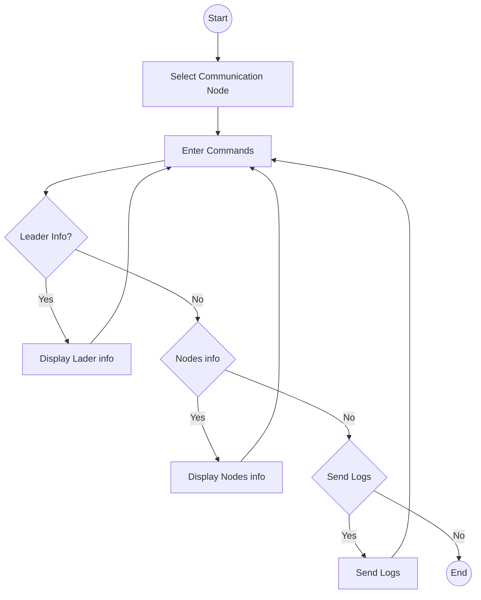

---

## **ARCHITECTURE.md**

markdown
# Architectural Design Document

## 1. Overview

This project implements a simplified **replicated log service** based on the **Raft consensus algorithm**.  
The system consists of multiple nodes (each representing a Raft server) that coordinate to elect a leader and replicate client commands consistently across all logs.

---

## 2. High-Level Architecture


Start up graph


Client Interface graph



---

## 3. Key Components

| Component | Responsibility |
|------------|----------------|
| ClientInterface | Interacts with the user. Sends requests and displays results. |
| AppendEntries | Defines the structure and data of AppendEntries RPC requests sent by the leader to followers for log replication. |
| AppendEntriesResponse | Represents the follower’s reply to an AppendEntries RPC, indicating success or failure of log replication. |
| RequestVote | Encapsulates the data for vote requests during leader election, including candidate ID and term. |
| RequestVoteResponse | Represents a node’s response to a vote request, indicating whether the vote was granted. |
| MessageServer | Listens for incoming RPC messages (RequestVote, AppendEntries). |
| MessageClient | Sends RPCs between nodes asynchronously. |
| ElectionManager | Handles election timeout and leader selection using randomized timers. |
| LogEntry | Defines a single log entry containing a term number and command for replication across nodes. |
| NodeRole | Enumerates the possible roles of a node in the Raft cluster — Leader, Follower, or Candidate. |
| NodeState | Stores term, votedFor, log entries, commit index, leaderId, etc. Persisted to disk. |
| NodeTimers | Manages periodic heartbeat sending by the leader and triggers elections. |
| Main | Launches the Raft node, initializes components, and starts network listeners and election timers. |
---

## 4. Data Persistence

Each node persists:
- state.json → currentTerm, votedFor, commitIndex
- log.json → all committed log entries
- manual_log.txt → plain-text trace log

Example entry in `log.json`:
```json
[
  {"term": 14, "command": "hi.."},
  {"term": 14, "command": "hi..."}
]
